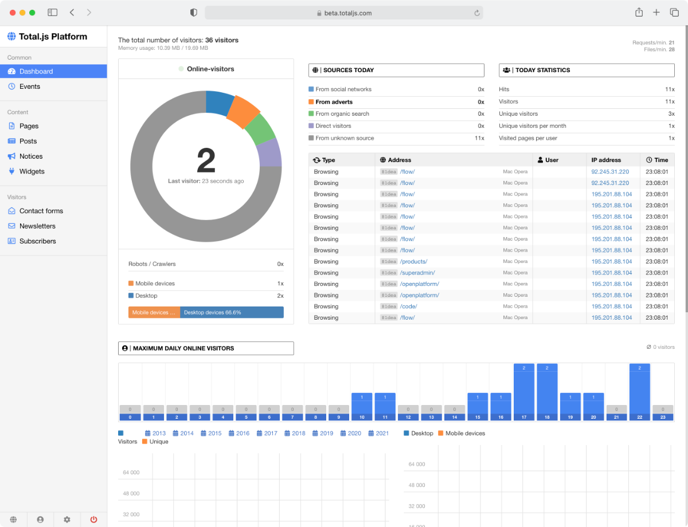

- [Class Readings](#class-readings)
- [PROJECT IDEA: CMS (Content Management System)](#project-idea-cms-content-management-system)
  - [Readings](#readings)

--- 

# Class Readings

- [Lesson 5: REST & JSON Alternatives 🔗](https://cse341.netlify.app/lesson5)
- [Lesson 6: Validation & Error Handling 🔗](https://cse341.netlify.app/lesson6)
  - A Clean Approach to Using `express-validator` [🔗](https://dev.to/nedsoft/a-clean-approach-to-using-express-validator-8go)
    - https://express-validator.github.io/docs/
  - `validatejs`
    - [./helpers/validate.js 🔗](https://github.com/byui-cse/cse341-code-student/blob/L06-team-complete/helpers/validate.js)
    - [./middleware/validate.js 🔗](https://github.com/byui-cse/cse341-code-student/blob/L06-team-complete/middleware/validate.js)
  - Validation in Node js Express Rest API [🔗](https://www.tutsmake.com/validation-in-node-js-express-rest-api/)
  - 7 - JOI Validation Schema to validate request body | Node JS API Authentication [🔗](https://www.youtube.com/watch?v=u9kxYilQ9l8)
  - Node.js Error Handling Made Easy: Best Practices On Just About Everything You Need to Know [🔗](https://sematext.com/blog/node-js-error-handling/)
  - Cleaner code in an Express REST API with unified error handling [🔗](https://www.codepedia.org/ama/cleaner-code-in-expressjs-rest-api-with-custom-error-handling)
  - Handling API Errors | RESTful API using NodeJS and MongoDB [🔗](https://www.youtube.com/watch?v=yNO-eA-8Fuo)
- [Lesson 7: OAuth 🔗](https://cse341.netlify.app/lesson7)
- [Lesson 8: OAuth 🔗](https://cse341.netlify.app/lesson8)

# PROJECT IDEA: CMS (Content Management System)

- A CMS software application allows users to create, manage, and publish digital content like articles, images, and videos.

## Readings

- https://github.com/totaljs/cms/tree/master
 - 
- https://blog.tooljet.com/build-cms-using-lowcode-and-mongodb/