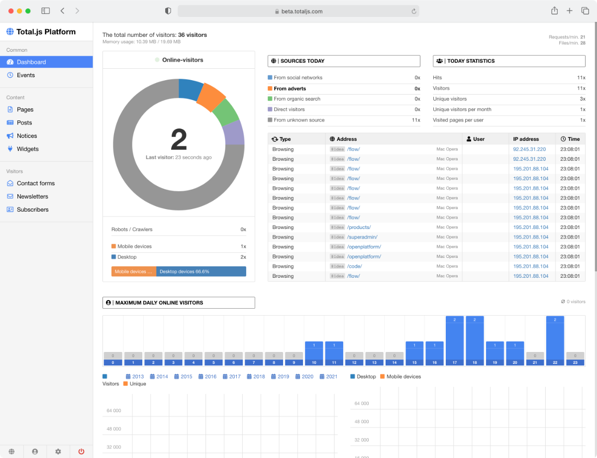

- [w01 -](#w01--)
- [w02 -](#w02--)
- [w03 - HTTP Requests \& Dev Tools (and, Linters and Formatters)](#w03---http-requests--dev-tools-and-linters-and-formatters)
  - [Linters and Formatters](#linters-and-formatters)
- [w04 - API Documentation](#w04---api-documentation)
  - [API Documentation](#api-documentation)
  - [Swagger](#swagger)
  - [Other Options](#other-options)
  - [Extra](#extra)
- [w05 - REST \& JSON Alternatives](#w05---rest--json-alternatives)
- [w06 - Validation \& Error Handling](#w06---validation--error-handling)
  - [Validation](#validation)
  - [Error Handling](#error-handling)
  - [Extra](#extra-1)
- [w07 - OAuth](#w07---oauth)
  - [Explanation](#explanation)
    - [Authentication Overview](#authentication-overview)
    - [OAuth Introduction](#oauth-introduction)
    - [OAuth2 Vs OAuth1](#oauth2-vs-oauth1)
  - [Hands On](#hands-on)
    - [Getting Started with OAuth](#getting-started-with-oauth)
    - [Node.js API + OAuth + MongoDb](#nodejs-api--oauth--mongodb)
  - [Extra](#extra-2)
- [w08 - OAuth](#w08---oauth)
  - [Explanation](#explanation-1)
    - [OAuth and Swagger](#oauth-and-swagger)
    - [JSON Web Tokens (JWT)](#json-web-tokens-jwt)
    - [JWT meets OAuth](#jwt-meets-oauth)
  - [Extra](#extra-3)
- [w09 -](#w09--)
- [w10 -](#w10--)
- [w11 -](#w11--)
- [w12 -](#w12--)
- [Resources](#resources)
- [PROJECT IDEA: CMS (Content Management System)](#project-idea-cms-content-management-system)
  - [Readings](#readings)

---

# w01 -

---

# w02 -

---

# w03 - HTTP Requests & Dev Tools (and, Linters and Formatters)

- [Lesson 03 🔗](https://cse341.netlify.app/lesson3)

## Linters and Formatters

- [VSCode ESLint, Prettier & Airbnb Style Guide Setup 🔗](https://youtu.be/SydnKbGc7W8)
  - eslint.org/docs/latest/ [🔗](https://eslint.org/docs/latest/)
- [VS Code Autoformatter - Configuring Prettier 🔗](https://youtu.be/wTRe2CjRZ4g)
- [Setup ESLINT and PRETTIER in React app 🔗](https://dev.to/knowankit/setup-eslint-and-prettier-in-react-app-357b)

---

# w04 - API Documentation

- [Lesson 04 🔗](https://cse341.netlify.app/lesson4)

## API Documentation

- [(OPTIONAL) Youtube: Intro to API Documentation 🔗](https://youtu.be/5pzhtrrtkXY)
- [What is API Documentation, and Why It Matters? 🔗](https://swagger.io/blog/api-documentation/what-is-api-documentation-and-why-it-matters/)

## Swagger

- [What is Swagger? 🔗](https://swagger.io/tools/open-source/getting-started/)
- [Create swagger.json from scratch (Design First) 🔗](https://support.smartbear.com/swaggerhub/docs/tutorials/getting-started.html)
- [Create swagger.json npm package (Development First) - `swagger-autogen` 🔗](https://www.npmjs.com/package/swagger-autogen)
- [swagger-ui-express 🔗](https://www.npmjs.com/package/swagger-ui-express)

## Other Options

- Be aware that there are other resources for doing very similar types of API documentation. None of them appear to be as widely integrated with npm or as widely used in industry. Two other popular ones are Postman (which started off as just a rest client), and Readme. We will only use Swagger in this course.

## Extra

- Repo: davibaltar/example-swagger-autogen [🔗](https://github.com/davibaltar/example-swagger-autogen/blob/master/swagger.js)

---

# w05 - REST & JSON Alternatives

- [Lesson 5 🔗](https://cse341.netlify.app/lesson5)

---

# w06 - Validation & Error Handling

- [Lesson 6 🔗](https://cse341.netlify.app/lesson6)

## Validation

- [What is Data Validation? 🔗](https://engage.safe.com/what-is/data-validation/)
- A Clean Approach to Using `express-validator` [🔗](https://dev.to/nedsoft/a-clean-approach-to-using-express-validator-8go)
  - https://express-validator.github.io/docs/
- `validatejs`
  - [./helpers/validate.js 🔗](https://github.com/byui-cse/cse341-code-student/blob/L06-team-complete/helpers/validate.js)
  - [./middleware/validate.js 🔗](https://github.com/byui-cse/cse341-code-student/blob/L06-team-complete/middleware/validate.js)
- Validation in Node js Express Rest API [🔗](https://www.tutsmake.com/validation-in-node-js-express-rest-api/)
- 📺 7 - JOI Validation Schema to validate request body | Node JS API Authentication [🔗](https://www.youtube.com/watch?v=u9kxYilQ9l8)

## Error Handling

- Node.js Error Handling Made Easy: Best Practices On Just About Everything You Need to Know [🔗](https://sematext.com/blog/node-js-error-handling/)
- Cleaner code in an Express REST API with unified error handling [🔗](https://www.codepedia.org/ama/cleaner-code-in-expressjs-rest-api-with-custom-error-handling)
- 📺 Handling API Errors | RESTful API using NodeJS and MongoDB [🔗](https://www.youtube.com/watch?v=yNO-eA-8Fuo)
  - https://github.com/trulymittal/Nodejs-REST-API

## Extra

- From teacher:
  - `user.js` [🔗](https://github.com/byui-cse/cse341-code-student/tree/L06-personal-solution-example)
  - Error handling video [🔗](https://youtu.be/S0przpEKKGU)
  - `validate.js` video [🔗](https://youtu.be/S0przpEKKGU?si=3htSi66dToezA5HI&t=631)
- [How to handle data validation in Node.js using validatorjs 🔗](https://blog.logrocket.com/handle-data-validation-node-js-validatorjs/)
- `validation-express`
  - [ValidationChain explanation 🔗](https://express-validator.github.io/docs/guides/validation-chain)
  - [ValidationChain API 🔗](https://express-validator.github.io/docs/api/validation-chain/)
  - [ARE YOU OVERUSING EXPRESS-VALIDATOR’S CUSTOM VALIDATOR? 🔗](https://addissoftware.com/are-you-overusing-express-validators-custom-validator/)

---

# w07 - OAuth

- [Lesson 7 🔗](https://cse341.netlify.app/lesson7)
  - Class Solution [🔗](https://github.com/byui-cse/cse341-code-student/tree/L07-class-complete?tab=readme-ov-file)

## Explanation

### Authentication Overview

- [Website Authentication: The Complete Guide with FAQs 🔗](https://swoopnow.com/website-authentication/)
  - A Modern Password: 6 Top Tips for A Secure Login Process [🔗](https://swoopnow.com/modern-password/)
- [RESTful API Authentication Basics 🔗](https://blog.restcase.com/restful-api-authentication-basics/)
  - Basic access authentication [🔗](https://en.wikipedia.org/wiki/Basic_access_authentication)
  - Intuitive Api Designer [🔗](https://www.restcase.com/platform/design) 🤔
- [Authorization vs Authentication 🔗](https://www.oauth.com/oauth2-servers/openid-connect/authorization-vs-authentication/)
  - OAuth 2.0 Playground [🔗](https://developers.google.com/oauthplayground/)

### OAuth Introduction

- [What is OAuth? Definition and How it Works 🔗](https://www.varonis.com/blog/what-is-oauth)
- [What the Heck is OAuth? 🔗](https://developer.okta.com/blog/2017/06/21/what-the-heck-is-oauth)
  - Enter OpenID Connect, aka OIDC (OAuth 2.0 extension) [🔗](https://developer.okta.com/blog/2017/06/21/what-the-heck-is-oauth#enter-openid-connect) - OIDC was made famous by Google and Microsoft, both big early adopters. Okta has made a big investment in OIDC as well.
  - OAuth 2.0 and OpenID Connect (in plain English) [🔗 ](https://youtu.be/996OiexHze0) 📺 1h

### OAuth2 Vs OAuth1

- [What’s the difference? OAuth 1.0 vs OAuth 2.0 🔗](https://www.synopsys.com/blogs/software-security/oauth-2-0-vs-oauth-1-0.html)
- [Differences Between OAuth 1 and 2 🔗](https://www.oauth.com/oauth2-servers/differences-between-oauth-1-2/)
- [OAuth 2.0: Benefits and use cases — why? 🔗](https://stackoverflow.com/questions/7561631/oauth-2-0-benefits-and-use-cases-why)

## Hands On

### Getting Started with OAuth

- [Simplified Oauth 2.0 Tutorial - Example with Node.js 🔗](https://youtu.be/PdFdd4N6LtI) 📺 ~11m
- [Google OAuth Docs - Node.js quickstart 🔗](https://developers.google.com/people/quickstart/nodejs)

### Node.js API + OAuth + MongoDb

- [Node.js App From Scratch | Express, MongoDB & Google OAuth 🔗](https://youtu.be/SBvmnHTQIPY) 📺 2h 28m
- [OAuth (Passport.js) Tutorial #12 - Saving User to MongoDB 🔗](https://youtu.be/KRCh6mSSsb8) 📺 ~10m

## Extra

- NodeJS & Express - Google OAuth2 using PassportJS [🔗](https://youtu.be/Q0a0594tOrc) 📺 ~20m
- Lesson 7 Class Activity Walkthrough: Auth0 + Google [🔗](https://youtu.be/52gurOGtaJM)

---

# w08 - OAuth

- [Lesson 8 🔗](https://cse341.netlify.app/lesson8)
  - Class Solution [🔗](https://github.com/byui-cse/cse341-code-student/branches/all?query=L08)

## Explanation

### OAuth and Swagger

- [OAuth 2.0 🔗](https://swagger.io/docs/specification/authentication/oauth2/)
  - The OAuth 2.0 Authorization Framework - fc6749 [🔗](https://datatracker.ietf.org/doc/html/rfc6749)
- [OAuth 2.0 configuration 🔗](https://swagger.io/docs/open-source-tools/swagger-ui/usage/oauth2/)

### JSON Web Tokens (JWT)

- [Introduction to JSON Web Tokens 🔗](https://jwt.io/introduction)
  - JSON Web Token (JWT) - fc7519 [🔗](https://datatracker.ietf.org/doc/html/rfc7519)
- [What is JWT and how does it work? 🔗](https://www.akana.com/blog/what-is-jwt)
  - API Basics For the Enterprise [🔗](https://www.akana.com/resources/api-basics)
  - API Security Best Practices [🔗](https://www.akana.com/resources/api-security-best-practices)
- [(OPTIONAL) YouTube: What Is JWT and Why Should You Use JWT 🔗](https://www.youtube.com/watch?v=7Q17ubqLfaM) 📺 ~15m
  - JWT Authentication Tutorial - Node.js [🔗](https://youtu.be/mbsmsi7l3r4) 📺 ~27m
  - JWT Playground [🔗](https://jwt.io/)

### JWT meets OAuth

- [OAuth vs JWT (JSON Web Tokens): An In-Depth Comparison 🔗](https://supertokens.com/blog/oauth-vs-jwt)
  - Revoking Access to JWT tokens with a Blacklist/Deny List [🔗](https://supertokens.com/blog/revoking-access-with-a-jwt-blacklist)
  - OAuth 2.0 vs Session Management [🔗](https://supertokens.com/blog/oauth-2-vs-session-management)
- [API Keys vs OAuth Tokens vs JSON Web Tokens 🔗](https://zapier.com/engineering/apikey-oauth-jwt/)

## Extra

- Top 3 Things You Should Know About Webhooks! [🔗](https://youtu.be/x_jjhcDrISk)

---

# w09 -

- [Lesson 9 🔗]()

---

# w10 -

- [Lesson 10 🔗]()

---

# w11 -

- [Lesson 11 🔗]()

---

# w12 -

- [Lesson 12 🔗]()

---

# Resources

- GitHub OAuth Apps - https://github.com/settings/developers
- supertokens/supertokens-core - https://github.com/supertokens/supertokens-core

---

# PROJECT IDEA: CMS (Content Management System)

- A CMS software application allows users to create, manage, and publish digital content like articles, images, and videos.

## Readings

- https://github.com/totaljs/cms/tree/master

  

- https://blog.tooljet.com/build-cms-using-lowcode-and-mongodb/
